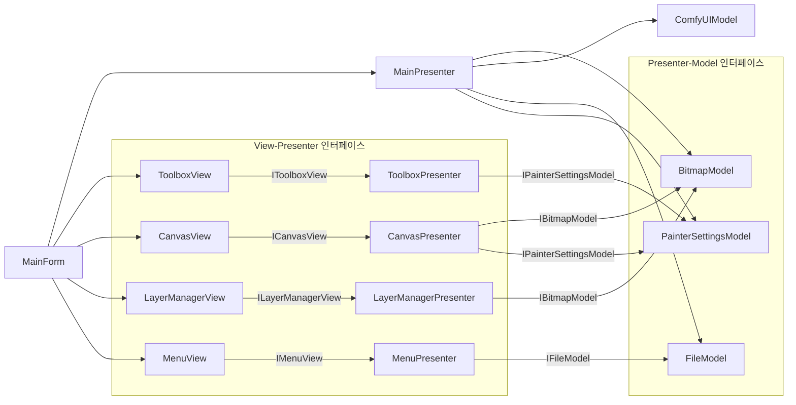

# 페인터 어플리케이션 아키텍처 설계 (인터페이스 기반 MVP 패턴)

## 5. 컴포넌트 간 관계 (인터페이스 계층 반영)

### 인터페이스 계층 설명:
1. **View-Presenter 인터페이스**:
   - `IToolboxView`: 도구 선택 이벤트 전달
   - `ICanvasView`: 마우스 이벤트 및 비트맵 업데이트
   - `ILayerManagerView`: 레이어 관리 이벤트
   - `IMenuView`: 파일 메뉴 이벤트

2. **Presenter-Model 인터페이스**:
   - `IBitmapModel`: 그림 데이터 조작
   - `IFileModel`: 파일 입출력
   - `IPainterSettingsModel`: 도구 설정 관리
   - `IComfyUIModel`: AI 이미지 생성 (생략됨)

### 아키텍처 원칙:
1. **계층 간 엄격한 분리**: 
   - View는 오직 Presenter 인터페이스만 알고, 구현 세부사항은 모름
   - Presenter는 Model 인터페이스만 알고, 구현 세부사항은 모름

2. **단방향 의존성**:
   - 의존성 방향: View → Presenter → Model
   - 역방향 참조 금지 (예: Model이 Presenter 참조하지 않음)

3. **인터페이스 계약**:
   - 각 계층은 인터페이스를 통해 상호작용
   - 인터페이스 변경 시 영향도 최소화