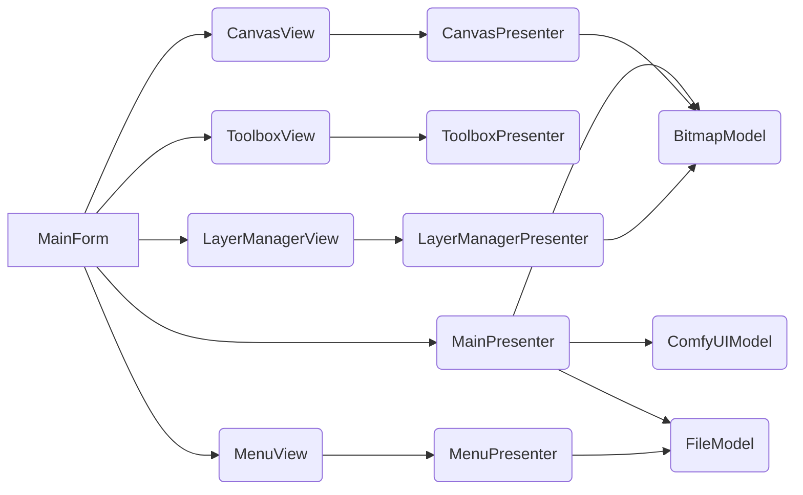

# 페인터 어플리케이션 아키텍처 설계 (MVP 패턴 기반)

## 1. 개요

본 문서는 WinForms 기반의 페인터 어플리케이션의 아키텍처 설계에 대한 내용을 담고 있습니다. MVP (Model-View-Presenter) 패턴을 기반으로 설계되었으며, UI와 비즈니스 로직을 분리하여 유지보수성 및 테스트 용이성을 높이는 데 초점을 맞추었습니다.

## 2. 요구사항 분석

*   **주요 대상 사용자:** 그림 입문자
*   **핵심 기능:** 그림 그리기, 편집, 레이어, AI 이미지 생성 연동 (ComfyUI)
*   **UI:** 직관적, 쉬운 사용, 한글/영어, 1K-4K 해상도, 다크/화이트 모드
*   **성능:** 크게 중요하지 않음
*   **운영체제:** Windows only
*   **프로그래밍 언어:** C#
*   **기타:** ComfyUI 연동, 낮은 GPU 사용량

## 3. 아키텍처 패턴: MVP (Model-View-Presenter)

MVP 패턴은 UI(View)와 비즈니스 로직(Model)을 분리하고, Presenter를 통해 View와 Model 간의 상호작용을 관리하여 테스트 용이성을 높이는 장점이 있습니다.

## 4. 시스템 구조

### 4.1. Model

*   `BitmapModel`: `Bitmap` 객체를 캡슐화하고, 그림 데이터 관리 및 그림 그리기 기능을 제공합니다.
*   `ComfyUIModel`: ComfyUI API와 연동하여 AI 이미지 생성 기능을 제공합니다.
*   `FileModel`: 파일 입출력 기능을 제공합니다.

### 4.2. View

*   `MainForm`: 어플리케이션의 메인 폼입니다.
*   `ToolboxView`: 도구 상자 UI를 담당합니다.
*   `CanvasView`: 그림 영역 UI를 담당합니다.
*   `LayerManagerView`: 레이어 관리 UI를 담당합니다.
*   `MenuView`: 메뉴 UI를 담당합니다.

### 4.3. Presenter

*   `MainPresenter`: `MainForm`과 상호작용합니다.
*   `ToolboxPresenter`: `ToolboxView`와 상호작용합니다.
*   `CanvasPresenter`: `CanvasView`와 상호작용합니다.
*   `LayerManagerPresenter`: `LayerManagerView`와 상호작용합니다.
*   `MenuPresenter`: `MenuView`와 상호작용합니다.

## 5. 컴포넌트 간 관계



## 6. 구현 계획

### 6.1. Model

*   `BitmapModel`: `Bitmap` 객체를 생성, 수정, 저장하는 기능을 구현합니다.
*   `ComfyUIModel`: `HttpClient`를 사용하여 ComfyUI API와 통신하는 기능을 구현합니다.
*   `FileModel`: 파일 저장 및 불러오기 기능을 구현합니다.

### 6.2. View

*   `MainForm`: UI 레이아웃을 구성하고, 각 View를 포함합니다.
*   `ToolboxView`: 도구 상자 UI를 구현하고, 사용자 입력을 `ToolboxPresenter`에게 전달합니다.
*   `CanvasView`: 그림 영역 UI를 구현하고, 그림 그리기 기능을 제공합니다. 사용자 입력을 `CanvasPresenter`에게 전달합니다.
*   `LayerManagerView`: 레이어 관리 UI를 구현하고, 레이어 추가, 삭제, 복사, 병합 기능을 제공합니다. 사용자 입력을 `LayerManagerPresenter`에게 전달합니다.
*   `MenuView`: 메뉴 UI를 구현하고, 파일 저장, 불러오기, 공유 기능을 제공합니다. 사용자 입력을 `MenuPresenter`에게 전달합니다.

### 6.3. Presenter

*   `MainPresenter`: 어플리케이션의 전체적인 흐름을 관리합니다.
*   `ToolboxPresenter`: 도구 상자 UI 로직을 처리하고, `BitmapModel`에게 그림 그리기 요청을 전달합니다.
*   `CanvasPresenter`: 그림 영역 UI 로직을 처리하고, `BitmapModel`에게 그림 데이터 관리 요청을 전달합니다.
*   `LayerManagerPresenter`: 레이어 관리 UI 로직을 처리하고, `BitmapModel`에게 레이어 관리 요청을 전달합니다.
*   `MenuPresenter`: 메뉴 UI 로직을 처리하고, `FileModel`에게 파일 입출력 요청을 전달합니다.

## 7. 프로젝트 구조

```
├── Painter.sln (솔루션 파일)
├── Painter (프로젝트 폴더)
│   ├── Properties (프로젝트 속성)
│   ├── Resources (리소스 폴더)
│   ├── References (참조)
│   ├── Models (모델 클래스)
│   ├── Views (뷰 인터페이스 및 클래스)
│   ├── Presenters (프레젠터 클래스)
│   ├── MainForm.cs (메인 폼)
│   ├── MainForm.Designer.cs (메인 폼 디자인 파일)
│   ├── Program.cs (프로그램 시작점)
│   ├── obj/ (빌드 관련 파일)
│   └── ... (기타 파일)
├── Painter.Tests (테스트 프로젝트 폴더)
├── docs (문서 폴더)
│   ├── architecture.md (아키텍처 문서)
│   ├── design.md (설계 문서)
│   └── requirements.md (요구사항 문서)
└── ... (기타 폴더 및 파일)
```

## 8. 추가 고려사항

*   **테스트:** 각 Presenter에 대한 단위 테스트를 작성하여 코드의 안정성을 확보합니다.
*   **ComfyUI 연동:** ComfyUI API 호출 빈도를 조절하여 GPU 사용량을 줄입니다.
*   **UI 디자인:** 사용자 경험을 고려하여 UI를 디자인합니다.
*   **스타일러스 필압:** 스타일러스 필압 기능을 지원합니다.