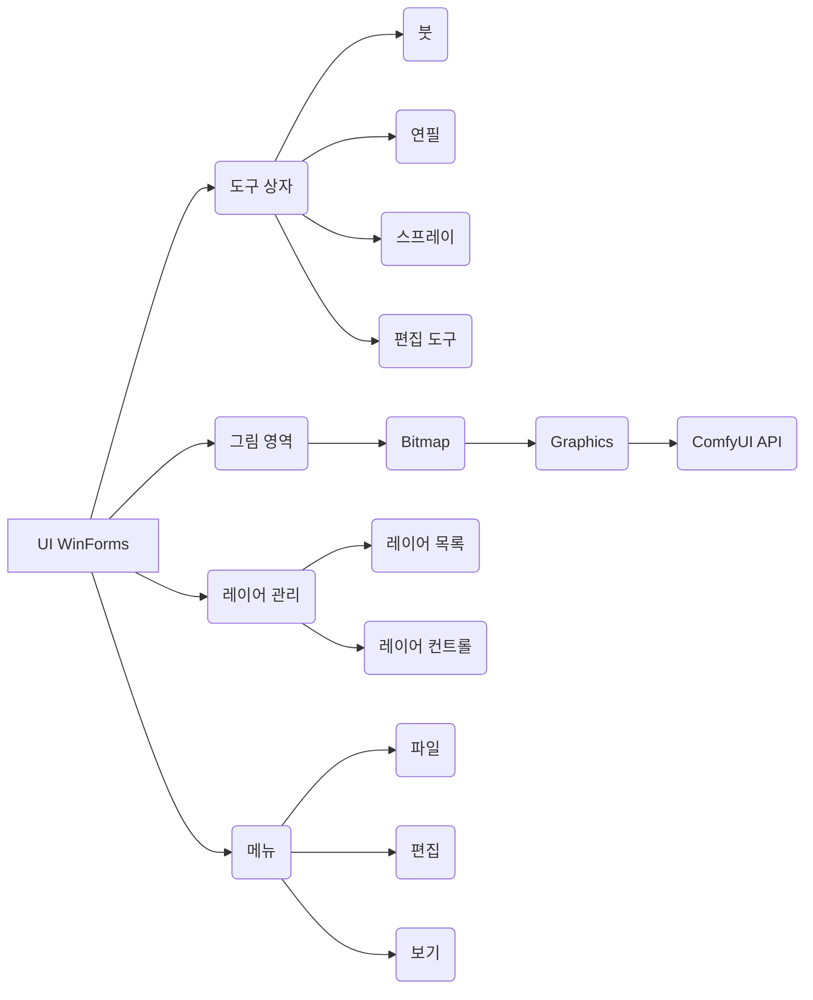

# 페인터 어플리케이션 설계 문서

## 1. 개요

본 문서는 WinForms 기반의 페인터 어플리케이션의 설계에 대한 내용을 담고 있습니다. 본 어플리케이션은 그림 입문자를 대상으로 쉽고 빠르게 그림을 그릴 수 있는 환경을 제공하며, ComfyUI와의 연동을 통해 AI 이미지 생성 기능을 지원합니다.

## 2. 요구사항 분석

본 설계는 다음 요구사항을 기반으로 합니다.

*   **주요 대상 사용자:** 그림 입문자
*   **핵심 기능:** 그림 그리기, 편집, 레이어, AI 이미지 생성 연동 (ComfyUI)
*   **UI:** 직관적, 쉬운 사용, 한글/영어, 1K-4K 해상도, 다크/화이트 모드
*   **성능:** 크게 중요하지 않음
*   **운영체제:** Windows only
*   **프로그래밍 언어:** C#
*   **기타:** ComfyUI 연동, 낮은 GPU 사용량

## 3. 아키텍쳐 설계

본 어플리케이션은 WinForms 기반의 데스크탑 어플리케이션으로, 다음과 같은 주요 컴포넌트로 구성됩니다.

*   **UI WinForms:** 사용자 인터페이스를 담당하며, 사용자의 입력을 받아들이고 결과를 표시합니다.
*   **도구 상자:** 그림 도구 (붓, 연필, 스프레이 등) 및 편집 도구 (자르기, 복사, 붙여넣기, 회전 등)를 제공합니다.
*   **그림 영역:** 그림이 그려지는 영역입니다.
*   **레이어 관리:** 레이어를 추가, 삭제, 복사, 병합하는 기능을 제공합니다.
*   **메뉴:** 파일 (저장, 불러오기, 공유), 편집 (실행 취소, 다시 실행), 보기 (다크 모드) 등의 메뉴 항목을 제공합니다.
*   **Bitmap:** 그림 데이터를 저장하고 관리합니다.
*   **Graphics:** 그림을 그리는 기능을 제공합니다.
*   **ComfyUI API:** ComfyUI와 연동하여 AI 이미지 생성 기능을 제공합니다.

각 컴포넌트 간의 관계는 다음과 같습니다.

1.  UI WinForms는 도구 상자, 그림 영역, 레이어 관리, 메뉴 컴포넌트를 포함합니다.
2.  도구 상자는 붓, 연필, 스프레이, 편집 도구 컴포넌트를 포함합니다.
3.  그림 영역은 Bitmap 컴포넌트를 사용하여 그림 데이터를 저장하고 관리합니다.
4.  레이어 관리는 레이어 목록, 레이어 컨트롤 컴포넌트를 포함합니다.
5.  메뉴는 파일, 편집, 보기 컴포넌트를 포함합니다.
6.  Bitmap 컴포넌트는 Graphics 컴포넌트를 사용하여 그림을 그립니다.
7.  Graphics 컴포넌트는 ComfyUI API 컴포넌트를 사용하여 AI 이미지 생성 기능을 제공합니다.

다음은 아키텍쳐 설계 다이어그램입니다.

## 4. 핵심 기능 구현

### 4.1. 그림 그리기

*   `Graphics` 객체를 사용하여 그림을 그립니다.
*   마우스 이벤트 (MouseDown, MouseMove, MouseUp)를 사용하여 사용자의 입력을 받습니다.
*   각 도구에 따라 다른 방식으로 그림을 그립니다. (예: 붓은 선을 그리고, 스프레이는 점을 찍습니다.)

### 4.2. 편집 기능

*   `Bitmap` 객체의 픽셀 데이터를 직접 조작하여 편집 기능을 구현합니다.
*   자르기, 복사, 붙여넣기, 회전
*   픽셀 유동화: 마우스 커서를 중심으로 주변 픽셀을 끌어당기거나 밀어내는 효과
*   올가미: 자유로운 형태의 영역을 선택하는 기능

### 4.3. 레이어 관리

*   `List<Bitmap>` 객체를 사용하여 레이어를 관리합니다.
*   각 레이어는 투명도를 가질 수 있습니다.
*   레이어 추가, 삭제, 복사, 병합 등의 기능을 제공합니다.

### 4.4. ComfyUI 연동

*   `HttpClient`를 사용하여 ComfyUI API와 통신합니다.
*   JSON serialization/deserialization을 사용하여 ComfyUI API 데이터를 전송합니다.
*   ComfyUI API를 사용하여 이미지 생성 및 레이어 연동 기능을 구현합니다.

## 5. UI 디자인

*   UI 스타일: 모던
*   주요 색상: 모노톤
*   아이콘 스타일: 아웃라인

본 어플리케이션의 UI는 사용자에게 직관적이고 쉬운 그림 그리기 환경을 제공하는 것을 목표로 합니다. UI는 크게 다음과 같은 영역으로 구성됩니다.

*   **도구 상자:** 그림 도구 (붓, 연필, 스프레이, 지우개 등) 및 편집 도구 (자르기, 복사, 붙여넣기, 회전 등)를 제공합니다. 도구 상자는 좌측에 위치하며, 각 도구는 아이콘과 함께 `Button` 컨트롤로 구현됩니다. `ColorPicker` 컨트롤을 사용하여 색상을 선택할 수 있으며, `TrackBar` 컨트롤을 사용하여 붓 크기, 스프레이 밀도 등을 조절할 수 있습니다.
*   **그림 영역:** 그림 영역은 우측 화면에 꽉 차게 표시되며, `PictureBox` 컨트롤로 구현됩니다. `Bitmap` 객체를 사용하여 그림 데이터를 저장하고 관리하며, `Graphics` 객체를 사용하여 그림을 그립니다.
*   **레이어 관리:** 레이어를 추가, 삭제, 복사, 병합하는 기능을 제공합니다. 레이어 관리는 그림 영역 위에 팝업 윈도우 형태로 표시되며, `ListBox` 또는 `TreeView` 컨트롤을 사용하여 레이어 목록을 표시합니다. `Button` 컨트롤을 사용하여 레이어 추가, 삭제, 복사, 병합 기능을 제공합니다. 팝업 윈도우는 세로로 긴 모양이며, 레이어가 많을 경우 스크롤 기능을 제공합니다. 레이어 관리 윈도우는 그림 영역의 완전한 우측에 위치합니다.
*   **메뉴:** 파일 (저장, 불러오기, 공유), 편집 (실행 취소, 다시 실행), 보기 (다크 모드) 등의 메뉴 항목을 제공합니다. 메뉴는 상단에 위치하며, `MenuStrip` 컨트롤을 사용하여 구현됩니다.

다음은 UI의 레이아웃을 간략하게 표현한 SVG 이미지입니다.

<svg width="800" height="600" xmlns="http://www.w3.org/2000/svg">
  <rect x="0" y="0" width="200" height="600" style="fill:lightgray;stroke-width:1;stroke:black" />
  <text x="100" y="30" font-size="20" text-anchor="middle">도구 상자</text>
  <rect x="200" y="0" width="600" height="600" style="fill:white;stroke-width:1;stroke:black" />
  <text x="400" y="30" font-size="20" text-anchor="middle">그림 영역</text>
  <rect x="700" y="300" width="100" height="600" style="fill:rgba(128,128,128,0.5);stroke-width:1;stroke:black" visibility="visible"/>
  <text x="750" y="320" font-size="16" text-anchor="middle" visibility="visible">레이어</text>
  <rect x="10" y="50" width="180" height="30" style="fill:white;stroke-width:1;stroke:black" />
  <text x="100" y="70" font-size="16" text-anchor="middle">붓</text>
</svg>

UI는 다크 모드와 화이트 모드를 지원하며, 사용자가 메뉴 또는 도구 상자의 버튼을 사용하여 모드를 전환할 수 있습니다. UI는 1K부터 4K까지 다양한 해상도를 지원하며, 각 해상도에 맞게 UI 요소의 크기와 위치가 자동으로 조정됩니다.

다음은 UI의 계층 구조도입니다.

*   Form (어플리케이션 윈도우)
    *   MenuStrip (메뉴)
        *   MenuItem (파일)
        *   MenuItem (편집)
        *   MenuItem (보기)
    *   SplitContainer (도구 상자, 그림 영역 분리)
        *   Panel (도구 상자)
            *   Button (붓)
            *   Button (연필)
            *   Button (스프레이)
            *   ...
            *   ColorPicker (색상 선택)
            *   TrackBar (붓 크기 조절)
        *   Panel (그림 영역)
            *   PictureBox (그림 표시)
            *   Popup 윈도우 (레이어 관리)
                *   ListBox (레이어 목록)
                    * ScrollBar (스크롤 기능)
                *   Button (레이어 추가)
                *   Button (레이어 삭제)
                *   Button (레이어 복사)
                *   Button (레이어 병합)

## 6. 기술 스택

*   프레임워크: WinForms
*   프로그래밍 언어: C#
*   UI 컨트롤:
    *   `TableLayoutPanel`, `FlowLayoutPanel`, `SplitContainer`, `Panel`, `Button`, `ColorPicker`, `TrackBar`, `PictureBox`, `ListBox`, `TreeView`, `MenuStrip`
*   이미지 처리:
    *   `Bitmap`, `Graphics`
*   ComfyUI 연동:
    *   `HttpClient` (HTTP API 통신)
    *   JSON serialization/deserialization (ComfyUI API 데이터 전송)
*   기타:
    *   `System.IO` (파일 입출력)
    *   `System.Drawing` (그림 그리기)

## 7. ComfyUI 연동 상세 설계

### 7.1. ComfyUI API 엔드포인트

*   이미지 생성: `/prompt`
*   이미지 정보: `/history`
*   워크플로우: `/workflow`

### 7.2. 데이터 전송 방식

*   JSON 형식으로 데이터를 전송합니다.
*   `HttpClient`의 `PostAsync` 메서드를 사용하여 데이터를 전송합니다.

## 8. 파일 저장/불러오기

*   파일 확장자: `.apainter`
*   고유한 파일 형식으로 그림 데이터를 저장하고 불러옵니다.

## 9. 기타 고려사항

*   낮은 GPU 사용량을 위해 ComfyUI API 호출 빈도를 조절합니다.
*   사용자 인터페이스의 다크 모드를 지원합니다.
*   다양한 해상도를 지원합니다.
*   스타일러스 필압 기능을 지원합니다.