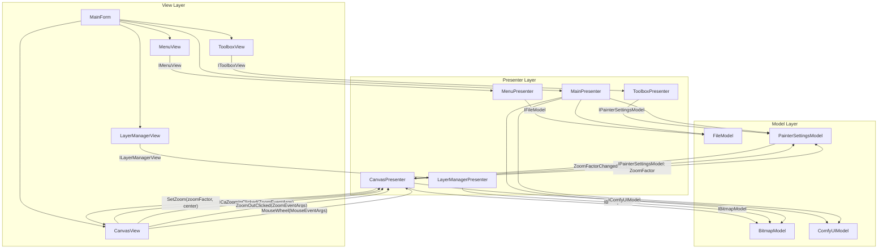
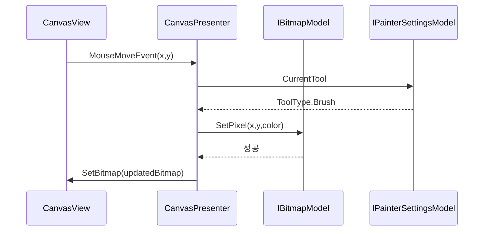
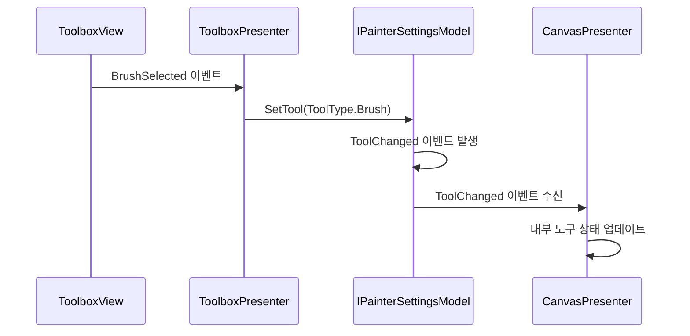
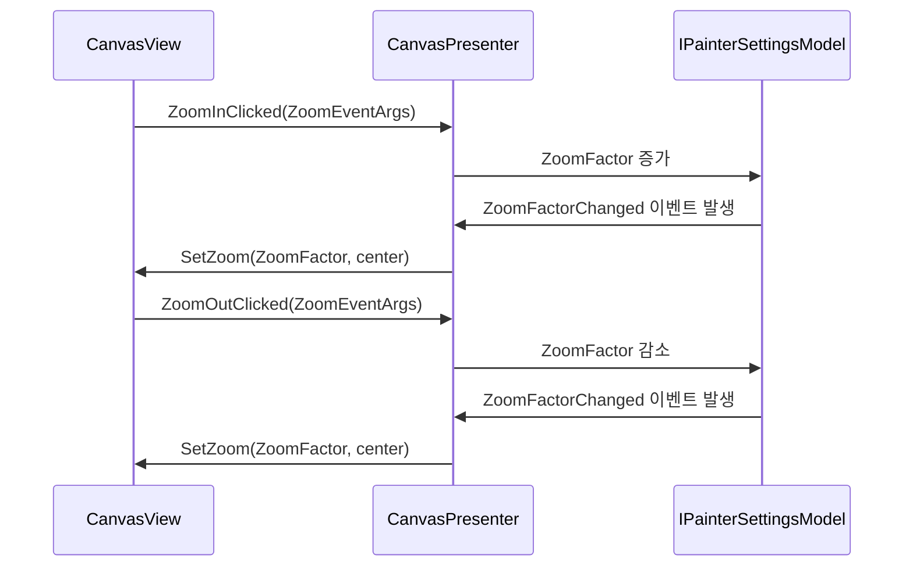
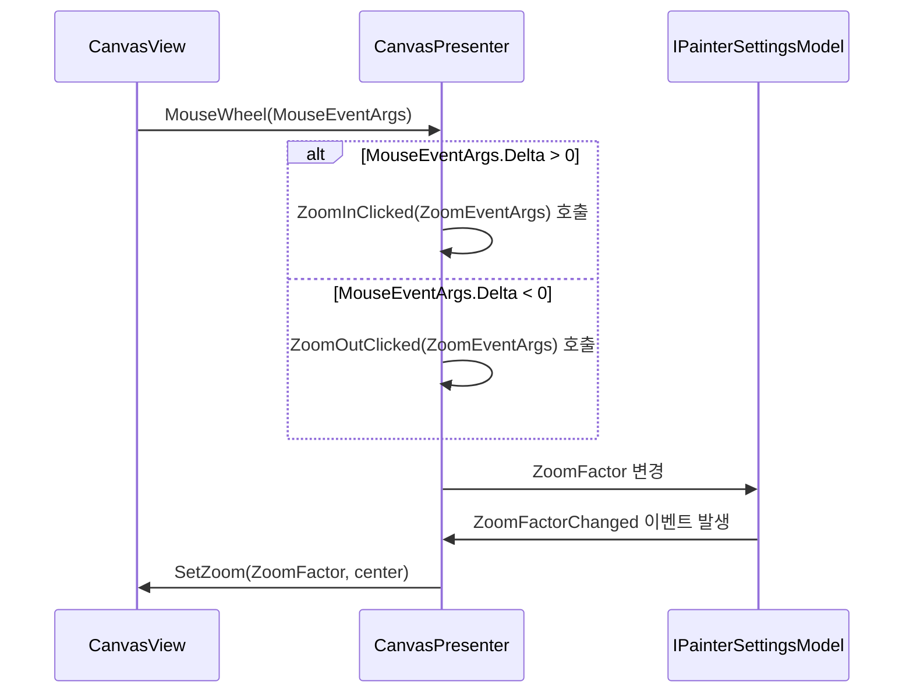

# 페인터 어플리케이션 설계 문서 (인터페이스 기반 MVP 패턴)

## 2. 아키텍처 설계 (업데이트)
### 2.1. 컴포넌트 계층과 인터페이스 통신


### 2.2. 인터페이스 계층 설명
1. **View-Presenter 계층**:
   - `IToolboxView`: 도구 선택 이벤트 전달
   - `ICanvasView`: 마우스 이벤트, 비트맵 업데이트 및 확대/축소 이벤트, 마우스 휠 이벤트
   - `ILayerManagerView`: 레이어 관리 이벤트
   - `IMenuView`: 파일 메뉴 이벤트

2. **Presenter-Model 계층**:
   - `IBitmapModel`: 그림 데이터 조작
   - `IFileModel`: 파일 입출력
   - `IPainterSettingsModel`: 도구 설정 관리 및 확대/축소 비율 관리
   - `IComfyUIModel`: AI 이미지 생성

### 2.3. 인터페이스 정의 (업데이트)
```csharp
// 설정 모델 인터페이스
public interface IPainterSettingsModel {
    ToolType CurrentTool { get; }
    Color PrimaryColor { get; set; }
    int BrushSize { get; set; }
    float ZoomFactor { get; set; }
    event Action ToolChanged;
    event Action PrimaryColorChanged;
    event Action BrushSizeChanged;
    event Action ZoomFactorChanged;
    void SetTool(ToolType tool);
}

// 비트맵 모델 인터페이스
public interface IBitmapModel : IDisposable {
    Bitmap GetBitmap();
    void Lock();
    void Unlock();
    void SetPixel(int x, int y, Color color);
    void Clear(Color color);
}

// 파일 모델 인터페이스
public interface IFileModel {
    void SaveToFile(Bitmap bitmap, string filePath);
    Bitmap LoadFromFile(string filePath);
}

// ComfyUI 모델 인터페이스
public interface IComfyUIModel {
    Task<string> GenerateImage(string prompt);
}

// 캔버스 뷰 인터페이스
public interface ICanvasView : IView {
    void SetBitmap(Bitmap bitmap);
    event MouseEventHandler MouseDownEvent;
    event MouseEventHandler MouseMoveEvent;
    event MouseEventHandler MouseUpEvent;
    event EventHandler<ZoomEventArgs> ZoomInClicked;
    event EventHandler<ZoomEventArgs> ZoomOutClicked;
    void SetZoom(float zoomFactor, PointF center);
    event MouseEventHandler MouseWheel;
}
```

## 3. 핵심 기능 구현 (변경사항 반영)
### 3.1. 그림 그리기 프로세스


### 3.4. 설정 변경 프로세스


### 3.5. 캔버스 확대/축소 프로세스


### 3.6. 스크롤을 이용한 캔버스 확대/축소 프로세스


## 6. 기술 스택 (업데이트)
* **의존성 주입**: Microsoft.Extensions.DependencyInjection
* **인터페이스 계약**: 모든 컴포넌트 간 통신은 인터페이스를 통해 수행
* **모의 테스트**: Moq를 이용한 인터페이스 기반 테스트