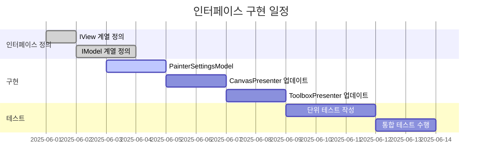

# APainter 개발 계획 (인터페이스 구현 로드맵)

## 3. 할 일 목록 (최종 업데이트)

### 3.1. 인터페이스 구현 (우선순위: 높음)
*   [x] 핵심 인터페이스 정의 (IView, ICanvasView, IToolboxView)
*   [x] 모델 인터페이스 정의 (IBitmapModel, IFileModel)
*   [x] 설정 모델 인터페이스 추가 (IPainterSettingsModel)
*   [ ] 인터페이스 버저닝 전략 수립

### 3.2. DI 통합 (우선순위: 높음)
*   [x] Microsoft.Extensions.DependencyInjection 통합
*   [x] 생성자 주입 기반 컴포넌트 연결
*   [ ] 인터페이스 기반 모의 테스트 환경 구성

### 3.3. 설정 관리 시스템 (우선순위: 높음)
*   [ ] `PainterSettingsModel` 구현
*   [ ] 설정 변경 이벤트 처리 메커니즘 구현
*   [ ] 설정 영속성 (저장/불러오기) 기능
*   [ ] UI와 설정 동기화

### 3.4. 테스트 계획 (업데이트)
*   [ ] 인터페이스 모의(Mock) 테스트
*   [ ] Presenter 단위 테스트 (모의 뷰 사용)
*   [ ] 설정 모델 상태 변경 테스트
*   [ ] 이벤트 처리 시나리오 테스트

### 3.5. 품질 관리 계획 (업데이트)
1. **인터페이스 검증**: 모든 컴포넌트가 인터페이스 계약을 준수하는지 확인
2. **의존성 검사**: 순환 참조 및 불필요한 의존성 제거
3. **계층 분리 테스트**: View-Presenter-Model 계층 간 침범 여부 검사
4. **이벤트 처리 검증**: 이벤트 구독/해제 누수 방지

## 4. 인터페이스 구현 로드맵

## 5. 위험 관리 계획 (업데이트)
| 위험 요소 | 대응 방안 | 진행 상태 |
|----------|----------|----------|
| 인터페이스 변경 | 1. 버저닝 적용 2. 기본 구현 제공 | 계획 수립 중 |
| 설정 동기화 지연 | 1. 이벤트 기반 갱신 2. 쓰로틀링 적용 | 구현 예정 |
| DI 구성 오류 | 1. 검증 로직 추가 2. 예외 처리 강화 | 부분 구현 |

## 6. 다음 단계
1. `PainterSettingsModel` 구현 및 DI 통합
2. 프레젠터 클래스 리팩토링 (인터페이스 기반)
3. 설정 변경 이벤트 처리 메커니즘 구현
4. 단위 테스트 환경 구성