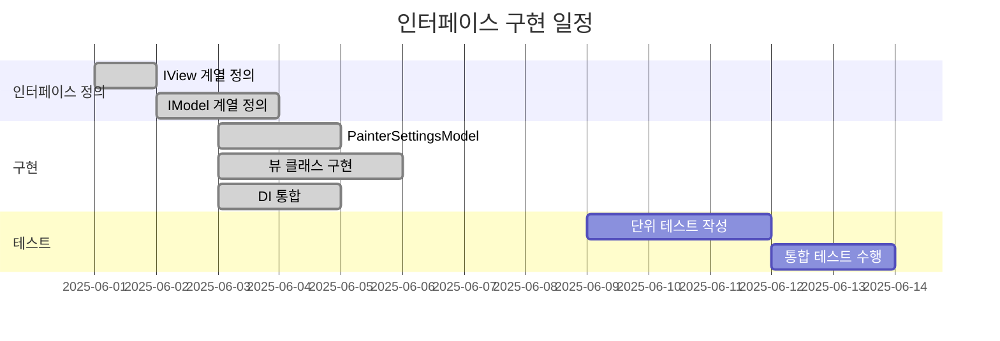
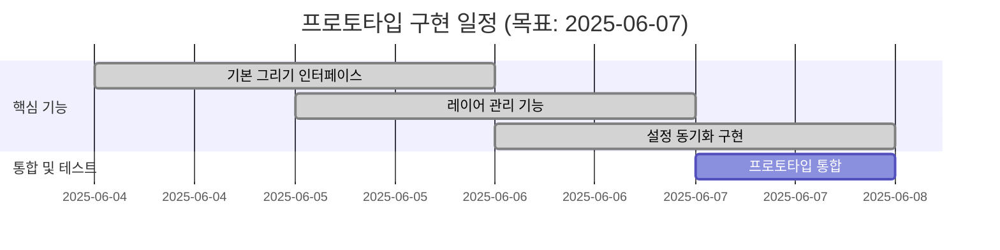
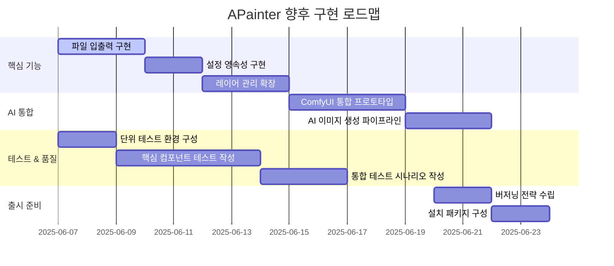

# APainter 개발 계획 (인터페이스 구현 로드맵)

## 3. 할 일 목록 (2025-06-03 업데이트)

### 3.1. 인터페이스 구현 (우선순위: 높음)
*   [x] 핵심 인터페이스 정의 (IView, IMainView, ICanvasView, IToolboxView)
*   [x] 확장 인터페이스 정의 (ILayerManagerView, IMenuView)
*   [x] 모델 인터페이스 정의 (IBitmapModel, IFileModel, IComfyUIModel)
*   [x] 설정 모델 인터페이스 추가 (IPainterSettingsModel)
*   [ ] 인터페이스 버저닝 전략 수립

### 3.2. DI 통합 (우선순위: 높음)
*   [x] Microsoft.Extensions.DependencyInjection 통합
*   [x] 생성자 주입 기반 컴포넌트 연결
*   [x] 뷰-프레젠터-모델 의존성 주입 구현
*   [ ] 인터페이스 기반 모의 테스트 환경 구성

### 3.3. 설정 관리 시스템 (우선순위: 높음)
*   [x] `PainterSettingsModel` 구현
*   [x] 설정 변경 이벤트 처리 메커니즘 구현
*   [ ] 설정 영속성 (저장/불러오기) 기능
*   [x] UI와 설정 동기화

### 3.4. 테스트 계획 (업데이트)
*   [ ] 인터페이스 모의(Mock) 테스트
*   [ ] Presenter 단위 테스트 (모의 뷰 사용)
*   [ ] 설정 모델 상태 변경 테스트
*   [ ] 이벤트 처리 시나리오 테스트
*   [ ] DI 컨테이너 구성 검증 테스트

### 3.5. 품질 관리 계획 (업데이트)
1. **인터페이스 검증**: 모든 컴포넌트가 인터페이스 계약을 준수하는지 확인
2. **의존성 검사**: 순환 참조 및 불필요한 의존성 제거
3. **계층 분리 테스트**: View-Presenter-Model 계층 간 침범 여부 검사
4. **이벤트 처리 검증**: 이벤트 구독/해제 누수 방지

## 4. 인터페이스 구현 로드맵

## 5. 위험 관리 계획 (업데이트)
| 위험 요소 | 대응 방안 | 진행 상태 |
|----------|----------|----------|
| 인터페이스 변경 | 1. 버저닝 적용 2. 기본 구현 제공 | 계획 수립 중 |
| 설정 동기화 지연 | 1. 이벤트 기반 갱신 2. 쓰로틀링 적용 | 구현 예정 |
| DI 구성 오류 | 1. 검증 로직 추가 2. 예외 처리 강화 | 구현 완료 |
| 뷰-모델 간 의존성 | 1. 인터페이스 분리 강화 2. 단위 테스트 강화 | 모니터링 중 |

## 6. 다음 단계
1. 설정 변경 이벤트 처리 메커니즘 구현
2. 단위 테스트 환경 구성
3. 레이어 관리 기능 구현

## 7. 프로토타입 개발 계획 (2025-06-04 업데이트)

### 7.1. 프로토타입 할 일 목록
*   [x] 기본 그리기 인터페이스 구현 (펜, 지우개)
*   [x] 레이어 관리 기능 구현 (최소 기능)
*   [x] 설정 변경 이벤트 처리 메커니즘 구현
*   [x] UI와 설정 동기화

### 7.2. 프로토타입 구현 로드맵

### 7.3. 프로토타입 위험 관리 계획
| 위험 요소 | 대응 방안 | 진행 상태 |
|----------|----------|----------|
| 인터페이스 변경 | 1. 최소 기능 집중 구현 2. 확장성 고려 | 적용 중 |
| 설정 동기화 지연 | 1. 이벤트 기반 갱신 | 구현 완료 |
| UI 반응성 문제 | 1. 비동기 처리 적용 2. 성능 최적화 | 모니터링 중 |

### 7.4. 프로토타입 이후 단계
1. 단위 테스트 환경 구성
2. 레이어 관리 기능 확장
3. 설정 영속성 기능 구현

## 8. 향후 구현 로드맵 (2025-06-06 업데이트)

### 8.1. 전체 구현 일정

### 8.2. 세부 구현 우선순위
1. **파일 입출력 (FileModel 구현)**
   - Bitmap 저장/불러오기 기능 (PNG/JPG 형식 지원)
   - 사용자 친화적인 파일 다이얼로그 통합
   
2. **설정 영속성**
   - JSON 기반 설정 저장 시스템 구현
   - 사용자별 설정 프로파일 관리 기능
   - 설정 불러오기/내보내기 기능

3. **레이어 관리 확장**
   - 레이어 병합/분리 기능 구현
   - 레이어 불투명도 조절 인터페이스
   - 다양한 블렌딩 모드 지원 (Multiply, Screen, Overlay)

4. **ComfyUI 통합**
   - 안정적인 API 연동 모듈 개발
   - 프롬프트 기반 이미지 생성 파이프라인 구축
   - 생성된 이미지를 캔버스에 적용하는 워크플로우 구현

### 8.3. 예상 위험 요소
- AI 서비스 지연으로 인한 UI 정지 방지를 위한 비동기 처리
- 대용량 이미지 처리 시 성능 저하 문제
- 크로스 플랫폼 호환성 검증 (Windows/macOS/Linux)