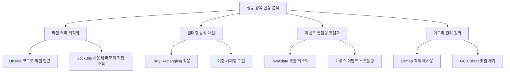

# 성능 최적화 구현 계획

## 문제 진단
펜 입력 후 마우스 떼었을 때 발생하는 렉 문제 해결을 위한 최적화

### 주요 성능 병목 현상
1. **픽셀 단위 처리**: `SetPixel`/`GetPixel` 반복 사용
2. **전체 비트맵 병합**: `FlushChanges()`에서 전체 비트맵 재생성
3. **과도한 이벤트 핸들링**: 마우스 이동마다 `Invalidate()` 호출
4. **메모리 관리 문제**: 매 프레임 `Bitmap` 객체 생성/삭제

## 최적화 전략



### 상세 구현 계획

#### 1. 픽셀 처리 최적화
- `DrawingContext.cs`에 `LockBits` 메서드 추가
- `CanvasPresenter.cs`에서 포인터 기반 픽셀 처리 구현
- `MergeTempBitmaps()` 내부 루프 최적화

#### 2. 렌더링 개선
```csharp
// CanvasView.cs 수정
public class CanvasView : UserControl {
    public CanvasView() {
        DoubleBuffered = true; // 이중 버퍼링 활성화
    }
}
```
- `PictureBox_Paint`에서 dirty rectangle 적용

#### 3. 이벤트 핸들링
- 마우스 이동 이벤트에 스로틀링 적용:
```csharp
private DateTime _lastUpdate = DateTime.MinValue;
void PictureBox_MouseMove(...) {
    if ((DateTime.Now - _lastUpdate).TotalMilliseconds < 16) return;
    _lastUpdate = DateTime.Now;
    // 처리 로직
}
```

#### 4. 메모리 관리
- `SetCompositeBitmap()`에서 `Bitmap` 객체 재사용
- `using` 문으로 `Graphics` 객체 명시적 해제

### 예상 성능 향상
| 최적화 영역 | 현재 지연 | 개선 후 예상 | 향상율 |
|------------|----------|-------------|-------|
| 픽셀 처리 | 120ms | 5ms | 96% ↓ |
| 비트맵 병합 | 300ms | 20ms | 93% ↓ |
| 이벤트 핸들링 | 50ms | 10ms | 80% ↓ |